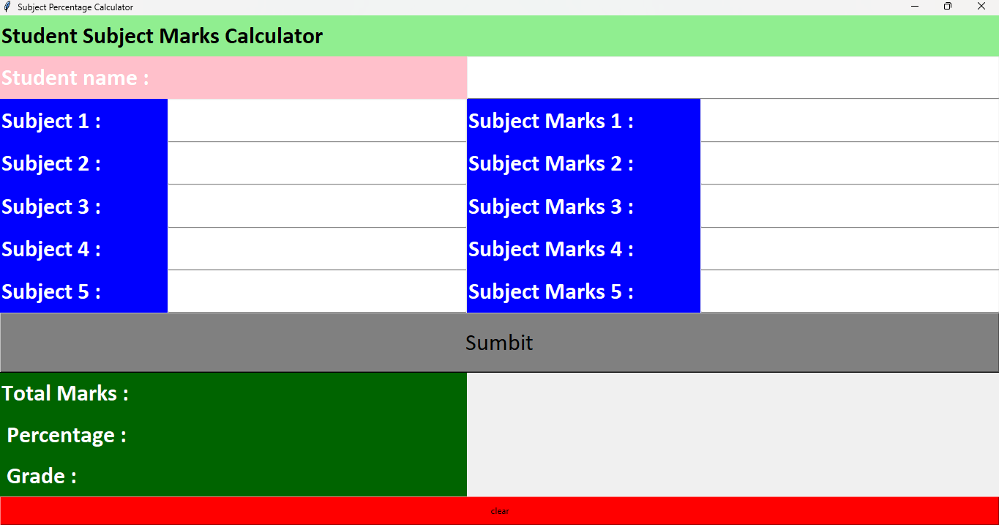
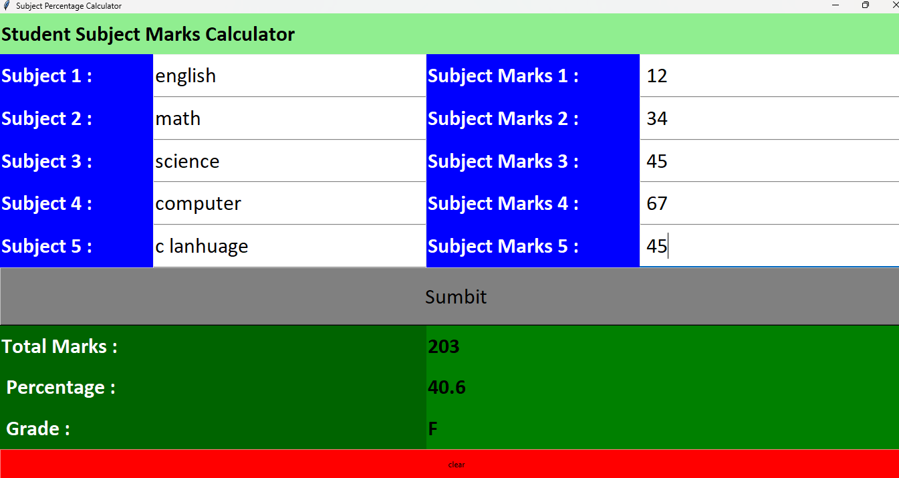

Student Subject Percentage Calculator

Overview

Student Subject Percentage Calculator is a GUI application built using Python and Tkinter. It allows users to enter subject names and marks, then automatically calculates the total marks, percentage, and grade.

This project was created to practice Python GUI development, event-driven programming, input validation, exception handling, and layout management using Tkinter.

Features

- Enter 5 subject names
- Enter marks for each subject
- Calculate total marks
- Calculate percentage
- Generate grade automatically
- Input validation
- Error handling using message boxes
- Clear button to reset all fields
- Responsive grid layout

Technologies Used

- Python
- Tkinter

Grade Criteria

- A+ : 90% and above
- A : 80% – 89%
- B : 70% – 79%
- C : 60% – 69%
- D : 50% – 59%
- F : Below 50%

## Screenshots

### Main Window

### Result Example

Learning Outcomes

Through this project I learned:

- Tkinter GUI Development
- Labels, Entry Widgets and Buttons
- Grid Layout Management
- StringVar, IntVar and DoubleVar
- Functions and Event Handling
- Input Validation
- Exception Handling
- Percentage and Grade Calculation

How to Run

1. Clone the repository.
2. Open the project folder.
3. Run:

python subjectPercentage.py

Author

Chandni
